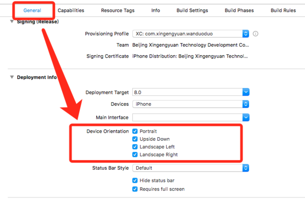
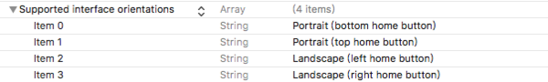

# iOS 横竖屏适配


关于横竖屏适配，有一句说一句，坑挺深的。

只要明白以下几点，横竖屏处理上并不是问题。

- 横竖屏方向枚举
- 开启横竖屏权限
- 在viewController 中如何开启横竖屏
- 横竖屏控制优先级
- 横竖屏适配
- 总结


## 一、横竖屏方向枚举介绍(坑)

**关于横竖屏一共有三种枚举**:

- UIInterfaceOrientation 
- UIDeviceOrientation
- UIInterfaceOrientationMask

### 1、 人机界面方向与设备方向`fangUIInterfaceOrientation与UIDeviceOrientation`


先看看下面这个枚举定义：(不注意看就会掉进坑里)

```
typedef NS_ENUM(NSInteger, UIInterfaceOrientation) {
    UIInterfaceOrientationUnknown            = UIDeviceOrientationUnknown,
    UIInterfaceOrientationPortrait           = UIDeviceOrientationPortrait,
    UIInterfaceOrientationPortraitUpsideDown = UIDeviceOrientationPortraitUpsideDown,
    UIInterfaceOrientationLandscapeLeft      = UIDeviceOrientationLandscapeRight,
    UIInterfaceOrientationLandscapeRight     = UIDeviceOrientationLandscapeLeft
}
```

我相信你应该看出了点东西了把，对于**iOS设备** 来讲，屏幕状态由以上五种状态

- 竖直向上
- 竖直向下
- 横屏向左
- 横屏向右
- 未知方向

当看到这个枚举的定义时, 从上到下似乎一切正常, 但是你倒着看上去就会发现**其中有坑**,  特别是第一次适配横竖屏.

>  坑在这里:
>
> 界面的枚举定义 与 设备的枚举定义, `竖直向上` `竖直向下` `未知方向` 这三中方向 是一一对应的关系, 但是`横屏向左` 和 `横屏向右` 界面定义的枚举和设备定义的枚举对应关系是反着的, **不注意很容易忽略这个错误问题, 造成调试半天没结果** 


### 2 、设备方向枚举 `UIDeviceOrientation`

事实上`设备方向` 的枚举一共是有`7` 个值,  而我们的界面方向只有`5`个取值.

分别对应`iPhone`未知方向，竖直，上下反转，向左旋转，向右旋转，屏幕朝上，屏幕朝下。关于横屏如何去分左右，其实API中的注释已经说明，当处于`UIDeviceOrientationLandscapeLeft`，home键在右侧，当处于`UIDeviceOrientationLandscapeRight`，home键在左侧。

所以，`UIDevice`顾名思义，事实上是用来判断设备方向的。


在设备进行横屏旋转的时候，为了横屏时上下不翻转，所以当Device处于Left时，界面应该是Right旋转。这样才不会使横屏时内容上下翻转。所以我想你应该明白了为什么在处于横屏时为什么他们俩的值是刚好相反的。

所以对于横竖屏适配，使用的枚举大家一定要看好，使用`UIInterfaceOrientation`。不要搞反。


### 3、 UIInterfaceOrientationMask(界面支持方向)


```
typedef NS_OPTIONS(NSUInteger, UIInterfaceOrientationMask) {
    UIInterfaceOrientationMaskPortrait = (1 << UIInterfaceOrientationPortrait),
    UIInterfaceOrientationMaskLandscapeLeft = (1 << UIInterfaceOrientationLandscapeLeft),
    UIInterfaceOrientationMaskLandscapeRight = (1 << UIInterfaceOrientationLandscapeRight),
    UIInterfaceOrientationMaskPortraitUpsideDown = (1 << UIInterfaceOrientationPortraitUpsideDown),
    UIInterfaceOrientationMaskLandscape = (UIInterfaceOrientationMaskLandscapeLeft | UIInterfaceOrientationMaskLandscapeRight),
    UIInterfaceOrientationMaskAll = (UIInterfaceOrientationMaskPortrait | UIInterfaceOrientationMaskLandscapeLeft | UIInterfaceOrientationMaskLandscapeRight | UIInterfaceOrientationMaskPortraitUpsideDown),
    UIInterfaceOrientationMaskAllButUpsideDown = (UIInterfaceOrientationMaskPortrait | UIInterfaceOrientationMaskLandscapeLeft | UIInterfaceOrientationMaskLandscapeRight),
}
```

事实上我们在横竖屏适配时，最常用的是这个枚举。这个枚举详细的列举了各种你需要的情况。我就不赘述了。官方的命名还是很舒服很好理解的。


## 二、 开启横竖屏权限(有坑)


### 方式1: (坑) 


  

可以看到这种勾选方式允许你进行四个方向的配置，并且这种勾选方式会直接在你的项目plist文件中添加



但是由于在这里配置是对项目启动时lanuch界面产生影响，而往往我们又没有对lanuch进行横竖屏适配，所以在这个时候我们就需要使用第二种方式进行配置。


### 方式二: (解决方式1的坑)


- 在项目中的AppDelegate文件中进行配置。

  ```
  #pragma mark - InterfaceOrientation 
  
  //应用支持的方向
  - (UIInterfaceOrientationMask)application:(UIApplication *)application supportedInterfaceOrientationsForWindow:(UIWindow *)window {
  		// 因为手机不支持向下, 所以此处返回这个枚举值
      return UIInterfaceOrientationMaskAllButUpsideDown;
  }
  ```

  搭配`UIInterfaceOrientationMask`使用，你可以很方便的让你项目开启你所需要的横竖屏权限和限制条件。


## 三、在VC中如何控制横竖屏(坑)

我们都知道MVC架构，那么显而易见，在我们开启了项目的横竖屏的限制之后，需要在`ViewController`进行相应的配置，才能真正实现横竖屏。


- 开启横竖屏，我们需要在VC中添加如下代码：

  ```
  // 设置界面支持的方向
  - (UIInterfaceOrientationMask)supportedInterfaceOrientations {
      return UIInterfaceOrientationMaskAll;
  }
  
  // 默认方向
  - (UIInterfaceOrientation)preferredInterfaceOrientationForPresentation {
      return UIInterfaceOrientationPortrait; // 或者其他值 balabala~
  }
  ```

  

  而对于横竖屏，手机端一般有**两种情况**: 

  - **情况一**, 手机没有开启横竖屏锁定，用户将手机横屏时触发的。对于这种情况，我们只需要在VC中添加如下代码即可：

    > 屏幕跟随手机方向自动调整

    ```
    // 开启自动转屏
    - (BOOL)shouldAutorotate {
        return YES;
    }
    ```

  - **情况二** , 是我们在项目中的某些条件下**强行让屏幕横屏或竖屏**， 例如: `大图预览`，`视频播放`，等等。而对于这种情况，我们可以使用下面👇这两种方法，都可以实现效果：

    ```
    - (void)setInterfaceOrientation:(UIInterfaceOrientation)orientation {
    
        if ([[UIDevice currentDevice] respondsToSelector:@selector(setOrientation:)]) {
            SEL selector = NSSelectorFromString(@"setOrientation:");
            NSInvocation *invocation = [NSInvocation invocationWithMethodSignature:[UIDevice instanceMethodSignatureForSelector:selector]];
            [invocation setSelector:selector];
            [invocation setTarget:[UIDevice currentDevice]];
            int val = orientation;
            [invocation setArgument:&val atIndex:2];
            [invocation invoke];
        }
    }
    ```

    ```
    - (void)setInterfaceOrientation:(UIDeviceOrientation)orientation {
        if ([[UIDevice currentDevice] respondsToSelector:@selector(setOrientation:)]) {
            [[UIDevice currentDevice] setValue:[NSNumber numberWithInteger:orientation] forKey:@"orientation"];
        }
    }
    ```

    > PS：这两个方法只有在`- (BOOL)shouldAutorotate( return YES; )`时，才会生效。并且请注意使用的枚举值的不同。


## 四、横竖屏控制优先级(坑)

在我们接手一个项目后，说要添加一个某个界面横竖屏需求时，发现按照上面的方式配置了一圈，发现还是转！不！成！功！What F***！！！

> 线面就是对坑的说明

事实上在这里我们要了解一个问题，就是关于横竖屏控制的优先级。对于限于`VC`范围来讲优先级最高的是当前的`window`的`rootViewController`，而往往我们的项目结构是容器视图控制器控制`VC`，`tabBarController`控制`navigationController`之后是`VC`，而横竖屏控制的优先级也是跟你的项目架构一样。而且是一旦优先级高的关闭了横竖屏配置，优先级低的无论如何配置都无法做到横竖屏。所以在你接受这个需求的时候，你需要看一下根视图的配置。


对于这种情况，我们有两种处理方式，一种是通过模态的方式跳转的下个`VC`，这个`VC`是隔离出来的，不在你之前的容器里，不会受到`rootViewController`的影响。


而另一种我们需要改造一下根视图的配置：

```
-(BOOL)shouldAutorotate {  
		
    return [[self.viewControllers lastObject] shouldAutorotate];  
}  

- (UIInterfaceOrientationMask)supportedInterfaceOrientations {  
     return [[self.viewControllers lastObject] supportedInterfaceOrientations];  
}  

- (UIInterfaceOrientation)preferredInterfaceOrientationForPresentation {  
    return [[self.viewControllers lastObject] preferredInterfaceOrientationForPresentation];  
}
```

或者

```
-(BOOL)shouldAutorotate {
    if ([[self.viewControllers lastObject]isKindOfClass:[NewViewController class]]) {
        return YES;
    }
    return NO;
}

- (UIInterfaceOrientationMask)supportedInterfaceOrientations {
    if ([[self.viewControllers lastObject]isKindOfClass:[NewViewController class]]) {
        return UIInterfaceOrientationMaskLandscapeLeft;
    }
    return UIInterfaceOrientationMaskPortrait;
}

- (UIInterfaceOrientation)preferredInterfaceOrientationForPresentation {
    if ([[self.viewControllers lastObject]isKindOfClass:[NewViewController class]]) {
        return UIInterfaceOrientationLandscapeLeft;
    }
    return UIInterfaceOrientationPortrait;
}
```

可以看到我们通过获取push栈中的最后一个`VC`的属性，或指定特殊的`VC`来进行`rootViewController`的横竖屏设置。

当然也可以通过`NSNotificationCenter`或者`NSUserDefaults`的方式对这里的值进行设置，在这里我就不过多赘述了。

总之要知道优先级的问题，`general` == `appDelegate` >> `rootViewController` >> `nomalViewController`

明白了权限的优先级以及开启的方法我想转屏就很显而易见了。


## 五、横竖屏适配

事实上旋转屏幕成功，对于iOS横竖屏问题我们只是完成了一半。另一半就是UI适配问题，其实这个要说起来就比较麻烦了，有些时候有很多case需要针对对应的业务条件来定制。但是无外乎几种实现思路。这里博主给大家抛几块砖哈：

首先我们要知道，当发生转屏事件时，系统的回调方法是：


**首先我们要知道，当发生转屏事件时，系统的回调方法是：** 

```
- (void)viewWillTransitionToSize:(CGSize)size withTransitionCoordinator:(id<UIViewControllerTransitionCoordinator>)coordinator {
    
    if (size.width > size.height) { // 横屏
        // 横屏布局 balabala
    } else {
        // 竖屏布局 balabala
    }
}
```

首推的方式是使用约束布局，在使用约束布局时，横竖屏转换时，在通常情况下约束条件会很相似，所以在布局上会极大的减少代码量。其次如果有个别的特殊问题，可以在上面的回调方法里面进行微调。


其次，对于转屏后，`[UIScreen mainScreen].bounds.size`以及`self.view.frame.size`的宽高系统会自动调换。即在横屏的时候`width > height`。所以在我们进行常规布局的时候我们可以选择控件的`frame`属性都与这两个属性进行比例换算。这样在当横竖屏转换的时候，重布局时，也会适应成对应屏幕下的布局。同样有需要特殊处理的布局，在上面的回调方法中进行细节微调即可。 


**对于子视图，在横竖屏切换时，会触发子视图重布局的方法：** 

```
- (void)layoutSubviews {
    [super layoutSubviews];
    // 通过状态栏电池图标来判断屏幕方向
    if ([UIApplication sharedApplication].statusBarOrientation == UIInterfaceOrientationMaskPortrait) {
        // 竖屏 balabala
    } else {
        // 横屏 balabala
    }
}
```

当然我只是说了几种比较简单的处理方式，和应对方法，对于整个项目都需要横竖屏适配的，我想还是一个比较复杂的过程。在实在处理不了的问题上，也可以通过写两套布局的方式来处理。至于过场动画，理论上如果你用约束和我说的比例布局的方式来写，基本系统会自动帮你这个问题给处理掉。但如果两种布局差距很大，你用了两套完全不同的布局，那这个你可能就要伤脑筋了。哈哈哈。不过有一些情况处理要求不严格的话可以使用截图过场大法来解决。不过这个就不是本文的设计范围了。大家如果感兴趣可以自己google一下。当然我日后的文章也可能会写到这了。到时候再来这里修改。 


## 六 总结

iPad横竖屏下的代码适配:https://www.jianshu.com/p/7cfabd741455

iOS 屏幕适配，autoResizing autoLayout和sizeClass图文详解: https://link.jianshu.com/?t=http://www.cnblogs.com/cxbblog/p/4166876.html

博主私人博客@HarwordLiu:https://link.jianshu.com/?t=http://www.harwordliu.com

